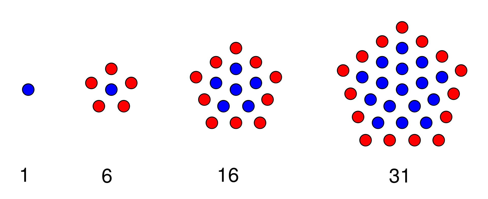

# Unidad 1 - Semana 1 - Clases y Punteros
Tarea #1 del curso de programación orientado a objetos, incluye el proyecto cmake: **poo2_unit1_week_1_2020-2**

## Contiene
- **main.cpp**, contiene pruebas en catch2.  
- **number.h y number.cpp**, contienen la declaración (.h) y definición (.cpp) de la clase **number_t**  
- **search_odds.h y search_odds.cpp**, contienen la declaración (.h) y definición (.cpp) de la función **search_odds**  
- **calculate_pentagon.h y calculate_pentagon.cpp**, contienen la declaración (.h) y definición (.cpp) de la función **calculate_pentagon**  
- **quick_sort.h y quick_sort.cpp**, contienen , contienen la declaración (.h) y definición (.cpp) de la clase **quick_sort** y de funciones adicionales de soporte.  
- **in_1.txt** contiene un ejemplo para el ejercicio de **quick_sort**.

## Problema 
Completar correctamente los métodos y sobrecarga de operadores de la clase **number_t** y utilizando esta clase resolver los siguientes problemas.  

1. Completar la función **search_odds** que tome como parametro un vector de objetos del tipo **number_t** y retornar en un vector todos los números (**number_t**) que aparezcan en el vector un numero impar de veces.
2. Completar la función **calculate_pentagon** que tome como parametro un numero positivo (**n**) y que calcule cuantos puntos existen en una figura pentagonal alrededor de un punto central en **n** iteraciones.  
En la imagen se puede ver que en la primera iteración (*n=1*) solo se obtiene 1 punto, en la segunda (*n=2*) se obtiene 6 y en la tercera (*n=3*) se obtiene 31.  
<p align="center">

</p>  
  
3. Completar las funciones **partition** y **quick_sort** que implementen el algoritmo de ordenamiento **quick** en forma recursiva y completar la clase **quicksort_t** basado en la función **quick_sort**, esta clase debe sobrecargar el operador << para recibir el nombre del archivo, abrirlo y ordenarlo usando la función **quick_sort** (en el ejemplo el archivo se llama **in.txt**), ordenarlo y sobrecargar el operador **>>** que creara un archivo con el nombre de archivo descrito (en el ejemplo **out.txt**) y grabara el contenido del archivo **in.txt** ordenado. 

    Ejemplo:  
    ```
    quicksort_t qs;
    qs << "in.txt";
    qs >> "out.txt";
    ```
## Rubrica  
- Los siguientes items seran evaluados:  

    |Problema|Excelente: Funciona correctamente en todos los test propuestos, el código esta bien organizado y los algoritmos utilizados son eficientes e implementados con un buen nivel de abstracción|Adecuado: Funciona correctamente al menos el 50% de los test propuestos, el código esta bien organizado y los algoritmos utilizados son eficientes e implementados con un buen nivel de abstracción|Insuficiente: No funciona correctamente en ninguno de los test propuestos, el código no esta bien organizado y los algoritmos utilizados son deficientes e implementados con un bajo nivel de abstracción|
    |--|:--:|:--:|:--:|
    |`number_t` |10 pts |5 pts |0 pts|
    |`search_odds` |2 pts |1 pts |0 pts |
    |`calculate_pentagon` |2 pts |1 pt |0 pts|
    |`quick_sort` |6 pts|3 pts|0 pts|
    
